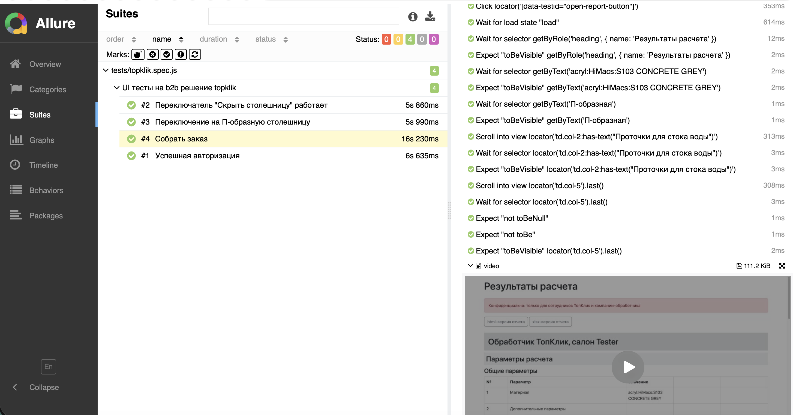

# UI-автотесты для b2b-конструктора столешниц Topklik


4 автотеста на Playwright для тестового стенда [dev.topklik.online](https://dev.topklik.online/): авторизация, переключатели конструктора и сквозной сценарий сборки заказа с проверкой отчёта. Page Object, Allure с видео падений, прогон в GitHub Actions на каждый push.

## Что покрыто

| Тест | Что проверяется |
| --- | --- |
| Успешная авторизация | после входа виден логотип главной страницы |
| Переключатель «Скрыть столешницу» | при выключении столешница не отображается |
| Переключение на П-образную столешницу | при выборе формы показывается П-образная столешница |
| Собрать заказ (E2E) | П-образная форма, толщина 4, без плинтуса, с островом и проточками для стока воды, цвет S103 CONCRETE GREY → расчёт → отчёт в новой вкладке: материал и цвет, тип столешницы, опция «Проточки для стока воды», итоговая цена выведена |

Вход выполняется в `beforeEach`, поэтому каждый тест стартует из авторизованного состояния.

## Стек

Playwright 1.58 · JavaScript · Allure Report (allure-playwright, allure-commandline) · GitHub Actions

## Структура

```
pages/
  loginPage.js      вход в систему
  mainPage.js       конструктор: форма, толщина, опции, цвет, расчёт
  reportPage.js     страница с результатами расчёта
tests/
  topklik.spec.js   4 теста
docs/
  allure-report.png пример отчёта
```

## Как запустить

Нужен Node.js 18 или новее.

```bash
git clone https://github.com/QASvetlana/playwright-test.git
cd playwright-test
npm ci
npx playwright install chromium
```

```bash
npm test               # headless
npm run test:headed    # с открытым браузером
```

## Отчёт

Allure 2 требует установленную Java 8 или новее.

```bash
npm run allure:generate
npm run allure:open
```

В отчёт попадают шаги теста, а для упавших тестов — скриншот, видео и trace при повторе.



## CI

Workflow **Playwright Tests** запускается на каждый push в `main` и вручную (Actions → Run workflow). Он ставит Chromium, гоняет тесты и сохраняет Allure-отчёт в артефакты сборки — даже если тесты упали.
